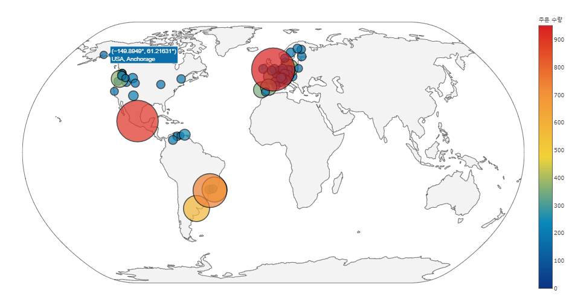

# APT 사의 매출 분석과 물류시스템 개선방안 도출
## 🖥️ 프로젝트 소개
이 프로젝트는 **Northwind Database**를 참고하여 만든 가상 물류 회사 APT의 대시보드를 만드는 것임
## 🕰️ 개발 기간
- **개발 기간**: 2024년 09월 14일 - 2024년 09월 17일

## ⚙️ 개발 환경
- **언어**: Python
- **IDE**: PyCharm
- **프레임워크**: Flask
- **데이터베이스**: Mysql
- **ORM**: SQLAlchemy
- **버전 관리**: Git
- **빌드 도구**: pip

## 📌 주요 기능
대시보드 주요 기능

① CSV > SQL 변환 코드 및 SQL > CSV 변환 코드
CSV 파일을 데이터베이스로 변환하거나, SQL 데이터를 CSV로 변환하여 내보내는 기능을 제공합니다. 이로써 데이터의 입력 및 출력을 손쉽게 처리할 수 있습니다.

② 레이아웃 테마 CSS 설정 (Dark 및 Light 테마 적용)
사용자는 대시보드에서 다크 모드 및 라이트 모드로 테마를 전환할 수 있습니다. 이 설정은 UI/UX 경험을 향상시키고, 사용자의 선호도에 맞게 대시보드 레이아웃을 개인화할 수 있습니다.

③ 로그인 및 로그아웃 구현
안전한 사용자 인증 시스템을 통해 사용자는 로그인 및 로그아웃 기능을 이용할 수 있습니다. 쿠키와 세션을 사용하여 사용자 데이터를 안전하게 관리합니다.

④ 영역차트 (Area Chart)
Chart.js를 사용하여 시간에 따른 데이터의 누적 변화를 시각화하는 영역차트를 제공합니다. 이 차트는 시계열 데이터를 비교할 때 유용합니다.

⑤ 바 차트 (Bar Chart)
범주형 데이터 간의 크기 비교를 시각화할 수 있는 바 차트를 제공합니다. 이 차트는 데이터 그룹 간의 차이를 명확하게 보여줍니다.

⑥ 선형 차트 (Line Chart)
시간에 따른 데이터 변화를 시각화하는 선형 차트를 제공합니다. 이 차트는 트렌드 분석과 데이터 변동 패턴을 파악할 때 유용합니다.

⑦ 산점도 (Scatter Plot)
두 변수 간의 상관관계를 시각화할 수 있는 산점도를 사용하여 데이터 포인트 간의 관계를 분석할 수 있습니다.

⑧ 원형 차트 (Pie Chart)
데이터의 비율을 직관적으로 보여주는 원형 차트를 제공합니다. 이를 통해 각 항목의 상대적인 비율을 시각화할 수 있습니다.

⑨ 레이더 차트 (Radar Chart)
레이더 차트를 사용하여 여러 변수 간의 균형과 분포를 비교합니다. 이 차트는 여러 항목의 상대적인 중요도를 한눈에 파악할 수 있습니다.

⑩ 누적 막대 차트 (Stacked Bar Chart)
누적 막대 차트는 각 범주의 누적된 데이터를 시각화하여 전체적인 데이터의 변화를 한눈에 파악할 수 있게 해줍니다.

⑪ 타임라인 차트 (Timeline)
vis-timeline을 사용하여 시간 순서대로 사건이나 프로젝트의 진행 상황을 타임라인 차트로 시각화합니다. 이는 프로젝트 관리와 일정 추적에 유용합니다.

⑫ 히트맵 (Heatmap)
D3.js를 활용하여 데이터의 패턴을 색상으로 표현하는 히트맵을 제공합니다. 히트맵은 데이터 간의 상관관계를 시각적으로 이해하는 데 매우 유용합니다.

⑬ 네트워크 (Network)
D3.js를 통해 요소들 간의 네트워크 관계를 시각화하여, 복잡한 데이터 관계를 그래픽으로 나타냅니다.

⑭ 맵 (Maps)
Leaflet.js를 사용하여 지리적 데이터를 시각화합니다. 이를 통해 위치 기반 데이터를 직관적으로 이해할 수 있으며, 다양한 지도를 지원합니다.

이 대시보드는 다양한 시각화 도구와 데이터 처리 기능을 통해 사용자가 데이터를 쉽고 직관적으로 분석할 수 있도록 설계되었습니다.

## 🛠️ 개발 과정
### 데이터베이스 구성

### 주피터 노트북

---

- **프로젝트 저장소**: [프로젝트 저장소](https://github.com/shiverlog/apt-dashboard)
- **프로젝트 문서**: [구글 드라이브](https://drive.google.com/drive/folders/1Q6HXYuKRZ2r6MezJknDy-DD6fcuuhVdC)
- **팀 노션**: [팀 노션](https://courageous-mango-380.notion.site/9d8cb228fada42b7a51e7cea4903f350?v=f9b8d723d3a04863a40a7a30f40180f2)
- **Azure 배포**: [Azure](https://apt-dashboard-ebd2c6hudxa7htar.koreacentral-01.azurewebsites.net/)

---
